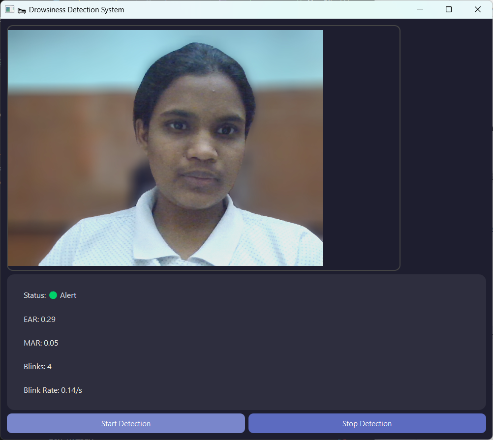
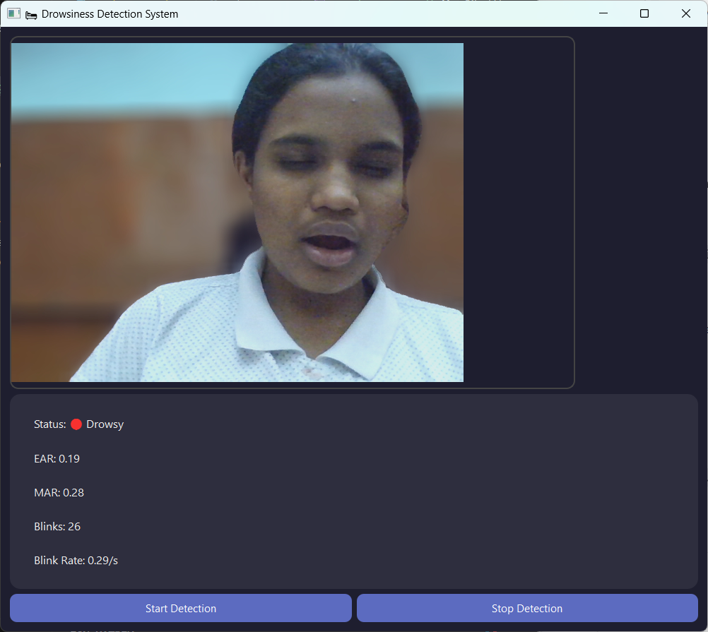

# 💤 Drowsiness Detection System

A desktop GUI application that detects drowsiness using a pre-trained machine learning model (`model.pkl`). Built with **Python**, **Tkinter**, and **scikit-learn**, the app simulates drowsiness detection and alerts the user with a beep sound.

---

## 💡 Features

- GUI with Start Detection button  
- Uses trained ML model (`model.pkl`)  
- Beep alert when drowsiness is detected  (in progress)
- Clean and modern UI using Tkinter  

---

## 🖥️ Screenshot




---

## 🔧 Installation & Setup

1. Clone the repository:
   ```bash
   git clone https://github.com/YOUR_USERNAME/drowsy-det-sys.git
   cd drowsy-det-sys
2. (Optional) Create and activate a virtual environment:
   ```bash
   python -m venv venv
   venv\Scripts\activate     # For Windows
4. Install required packages:
   ```bash
   pip install -r requirements.txt
6. Run the app:
   ```bash
   python modern_ui.py

## Future Enhancement:
    Beep alert when drowsiness is detected
    
## 🙋‍♀️ Author
Pavithra Revankar
